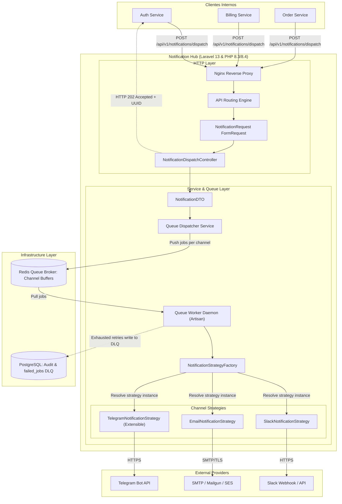
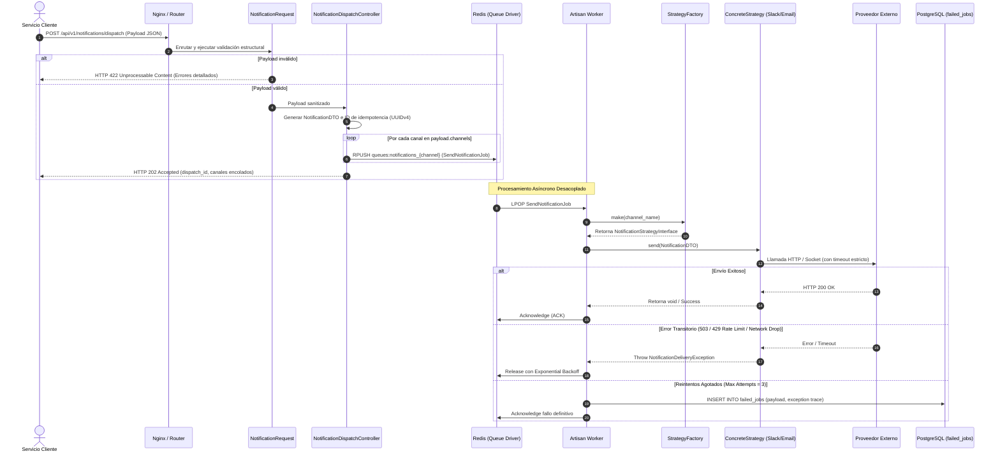

# Technical Design Document (RFC-0001): Notification Hub Microservice

| Metadata | Detalle |
| :--- | :--- |
| **Proyecto** | Notification Hub |
| **Document ID** | RFC-0001-NOTIF-HUB |
| **Autor** | Erick Pulido |
| **Fecha de Creación** | 18 de Septiembre de 2026 |
| **Última Actualización** | 18 de Septiembre de 2026 |
| **Versión** | 1.0.0 |
| **Estado** | `APPROVED / READY FOR IMPLEMENTATION` |
| **Revisores** | Erick Pulido |

---

# Arquitectura del Sistema: Notification Hub

## 1. Overview y Arquitectura

El microservicio **Notification Hub** centraliza, desacopla y orquesta el despacho de notificaciones multicanal (Slack, Email, SMS, Webhooks, Push, etc.) originadas por servicios internos de la plataforma. La arquitectura mitiga la dispersión de credenciales, unifica las políticas de reintentos y observabilidad, y aísla a los servicios clientes de la latencia y tasa de fallo de los proveedores externos de mensajería.

El sistema opera bajo un modelo no bloqueante impulsado por eventos:
1. La capa de API ingesta las solicitudes HTTP, valida el contrato y despacha jobs asíncronos a colas de mensajería dedicadas en memoria.
2. Un pool distribuido de workers procesa cada canal de forma aislada, invocando las implementaciones concretas de despacho mediante inyección de dependencias.

### 1.1. Diagrama de Componentes (C4 Nivel 3)



### 1.2. Diagrama de Secuencia



---

## 2. Justificación de Decisiones Técnicas y Trade-offs

### 2.1. Ingesta Asíncrona (`202 Accepted`) vs. Procesamiento Síncrono

* **Decisión adoptada:** El endpoint valida estructuralmente el payload, genera identificadores de rastreo (UUIDv4) y encola un trabajo individual por cada canal solicitado antes de responder inmediatamente un código de estado `HTTP 202 Accepted`.
* **Ventajas:**
  * **Latencia Predecible:** La latencia de la API se mantiene típicamente en sub-20ms, independientemente de si la notificación va a 1 o a 10 canales.
  * **Aislamiento de Fallos Externos:** Una degradación en el Webhook de Slack o saturación del servidor SMTP no agota los procesos PHP-FPM del Notification Hub ni bloquea el hilo de ejecución del cliente.
  * **Control de Concurrencia:** Los workers consumen a un ritmo controlado, evitando penalizaciones por rate limiting de proveedores terceros.
* **Desventajas / Trade-offs:**
  * **Consistencia Eventual:** El cliente no obtiene la confirmación definitiva de entrega de manera sincrónica. Requiere trazabilidad por UUID o webhooks de estado para monitoreo diferido.

### 2.2. Broker de Mensajería: Redis Queues vs. Apache Kafka

* **Decisión adoptada:** Uso de Redis mediante el driver de colas nativo de Laravel (`horizon` / worker daemons) particionado por canal.
* **Ventajas:**
  * **Simplicidad Operativa y Huella de Memoria:** Redis opera en memoria con una latencia mínima de I/O, sin la sobrecarga administrativa ni el overhead de recursos de Apache Kafka / Zookeeper / KRaft.
  * **Soporte Nativo de Retrasos y Reintentos:** Redis gestiona de forma nativa estructuras `ZSET` para el manejo de reintentos temporizados (`available_at` con backoff exponencial).
  * **Capacidad de Throughput Adecuada:** Cumple con holgura demandas de miles de mensajes por segundo por nodo sin incurrir en complejidad de particionamiento manual.
* **Trade-offs / Desventajas:**
  * **Retención:** Redis no está diseñado como log de eventos distribuido inmutable a largo plazo. Una vez procesado y confirmado el job, desaparece de memoria. Para auditoría permanente, las fallas terminales se persisten en PostgreSQL (`failed_jobs`).
* **Nota de implementación:**
  * Para escenarios donde el volumen supere los 10k eventos/sec, Redis mantendrá el alto rendimiento en memoria, pero requerirá persistencia RDB/AOF activa o migración a RabbitMQ/Kafka si se exige cero pérdida de mensajes en caso de reinicio abrupto del nodo.

### 2.3. Patrones de Diseño: Strategy + Factory

* **Decisión adoptada:** Implementación conjunta del patrón **Strategy** (para encapsular el transporte y la lógica específica de cada proveedor) y el patrón **Factory** (para resolver dinámicamente la estrategia correcta en runtime según el identificador de canal).
* **Ventajas:**
  * **Cumplimiento de Principios SOLID:**
    * **Single Responsibility Principle (SRP):** Cada clase concreta de estrategia administra exclusivamente la conexión, payload formatting y parsing de respuesta de su respectivo proveedor.
    * **Open/Closed Principle (OCP):** La adición de un nuevo canal no altera el controlador, ni el job de despacho, ni las estrategias existentes. Solo se crea una nueva implementación y se registra en el contenedor de servicios.
  * **Testabilidad Aislada:** Las estrategias se prueban unitariamente mediante mocks del cliente HTTP, sin instanciar la infraestructura completa.
* **Trade-offs / Desventajas:**
  * Ligero incremento en la cantidad de clases y archivos de infraestructura dentro del proyecto.

---

## 3. Contrato de API y Eventos

### 3.1. Endpoint Único de Despacho

* **Ruta:** `POST /api/v1/notifications/dispatch`
* **Content-Type:** `application/json`
* **Accept:** `application/json`

### 3.2. Especificación de Payload (Request Body)

```json
{
  "event_type": "USER_WELCOME",
  "channels": [
    "slack",
    "email",
    "telegram"
  ],
  "payload": {
    "user_id": "usr_9984b3d2-45e6-42bc-a22b-5b56dcfa2110",
    "email": "arquitectura@empresa.com",
    "recipient_name": "Dev Ops Lead",
    "telegram_chat_id": "-1001234567890",
    "message": "Bienvenido a la plataforma de microservicios.",
    "metadata": {
      "ip_address": "192.168.1.100",
      "environment": "production"
    }
  }
}
```

#### Esquema de Validación (JSON Schema)

```json
{
  "$schema": "https://json-schema.org/draft/2020-12/schema",
  "type": "object",
  "required": ["event_type", "channels", "payload"],
  "properties": {
    "event_type": {
      "type": "string",
      "minLength": 3,
      "maxLength": 64,
      "pattern": "^[A-Z0-9_]+$"
    },
    "channels": {
      "type": "array",
      "minItems": 1,
      "uniqueItems": true,
      "items": {
        "type": "string",
        "enum": ["slack", "email", "sms", "telegram"]
      }
    },
    "payload": {
      "type": "object",
      "required": ["message"],
      "properties": {
        "message": {
          "type": "string",
          "minLength": 1,
          "maxLength": 4096
        },
        "email": {
          "type": "string",
          "format": "email"
        },
        "user_id": {
          "type": "string"
        },
        "recipient_name": {
          "type": "string"
        },
        "telegram_chat_id": {
          "type": "string",
          "description": "ID único de chat o canal de Telegram. Si se omite, la estrategia utiliza el chat ID por defecto del sistema."
        },
        "metadata": {
          "type": "object",
          "additionalProperties": true
        }
      },
      "additionalProperties": true
    }
  },
  "additionalProperties": false
}
```

### 3.3. Respuestas HTTP del Sistema

#### Respuesta Exitosa: `202 Accepted`

Indica que la solicitud pasó todas las reglas semánticas y de sintaxis, y los jobs fueron encolados para su ejecución asíncrona.

```json
{
  "status": "success",
  "message": "Notification event accepted for processing.",
  "data": {
    "dispatch_id": "a9d7c041-3b7c-47ea-a2b1-91d120a1789c",
    "event_type": "USER_WELCOME",
    "queued_channels": [
      {
        "channel": "slack",
        "queue": "notifications_slack",
        "job_id": "f51b6890-a320-410e-953e-5ef3c591bfb4"
      },
      {
        "channel": "email",
        "queue": "notifications_email",
        "job_id": "76ba181c-8e4d-4952-bc62-3bf2c37e6113"
      },
      {
        "channel": "telegram",
        "queue": "notifications_telegram",
        "job_id": "18cd92ef-112a-4a22-9988-82ab81ef9012"
      }
    ],
    "created_at": "2026-09-18T02:13:44.102Z"
  }
}
```

#### Respuesta de Error de Validación: `422 Unprocessable Content`

Indica que el payload incumple el contrato o contiene canales inexistentes o mal tipados.

```json
{
  "status": "error",
  "message": "The given data was invalid.",
  "errors": {
    "channels.1": [
      "The selected channels.1 is invalid. Supported channels are: slack, email, sms, telegram."
    ],
    "payload.message": [
      "The payload.message field is required."
    ]
  }
}
```

#### Respuesta de Error Interno: `500 Internal Server Error`

Generado únicamente cuando el almacenamiento de colas (Redis) no responde o existe una excepción no interceptada en el pipeline del framework.

```json
{
  "status": "error",
  "message": "Could not enqueue notification event. Infrastructure unavailable.",
  "code": "QUEUE_CONNECTION_FAILURE"
}
```

---

## 4. Estrategia de Extensibilidad (Open/Closed Principle)

El diseño desacopla la recepción del evento de su ejecución física. Para añadir un nuevo canal (ejemplo: `telegram`), **no se modifica el controlador, ni el job base, ni las clases existentes**. Se aplican únicamente adiciones modulares.

### 4.1. Interfaz Base del Canal

```php
declare(strict_types=1);

namespace App\Services\Notifications\Contracts;

use App\DTOs\NotificationDTO;

interface NotificationStrategyInterface
{
    /**
     * Retorna el identificador unívoco del canal (ej: 'slack', 'email', 'telegram').
     */
    public static function getChannelIdentifier(): string;

    /**
     * Ejecuta el despacho del payload hacia el proveedor.
     *
     * @throws \App\Exceptions\NotificationDeliveryException
     */
    public function send(NotificationDTO $notification): void;
}
```

### 4.2. Fábrica de Estrategias (`NotificationStrategyFactory`)

La factoría resuelve las estrategias dinámicamente mediante el contenedor de servicios de Laravel, aprovechando el tagged container pattern:

```php
declare(strict_types=1);

namespace App\Services\Notifications;

use App\Services\Notifications\Contracts\NotificationStrategyInterface;
use InvalidArgumentException;

final class NotificationStrategyFactory
{
    /**
     * @var array<string, NotificationStrategyInterface>
     */
    private array $strategies = [];

    /**
     * @param iterable<NotificationStrategyInterface> $strategies
     */
    public function __construct(iterable $strategies)
    {
        foreach ($strategies as $strategy) {
            $this->strategies[$strategy::getChannelIdentifier()] = $strategy;
        }
    }

    public function make(string $channel): NotificationStrategyInterface
    {
        return $this->strategies[$channel] ?? throw new InvalidArgumentException(
            sprintf('Channel [%s] is not supported by any registered strategy.', $channel)
        );
    }

    /**
     * @return array<string>
     */
    public function getSupportedChannels(): array
    {
        return array_keys($this->strategies);
    }
}
```

### 4.3. Guía Paso a Paso: Adición del Canal `Telegram`

Sin tocar el `NotificationDispatchController` ni las demás estrategias:

1. **Crear la Estrategia:** Crear el archivo `app/Services/Notification/Strategies/TelegramNotificationStrategy.php`:

```php
declare(strict_types=1);

namespace App\Services\Notifications\Strategies;

use App\Services\Notifications\Contracts\NotificationStrategyInterface;
use App\DTOs\NotificationDTO;
use App\Exceptions\NotificationDeliveryException;
use Illuminate\Support\Facades\Http;
use Throwable;

final class TelegramNotificationStrategy implements NotificationStrategyInterface
{
    public function __construct(
        private readonly string $botToken,
        private readonly string $defaultChatId
    ) {}

    public static function getChannelIdentifier(): string
    {
        return 'telegram';
    }

    public function send(NotificationDTO $notification): void
    {
        $chatId = $notification->payload['telegram_chat_id'] ?? $this->defaultChatId;

        try {
            $response = Http::timeout(5)
                ->retry(2, 100)
                ->post("https://api.telegram.org/bot{$this->botToken}/sendMessage", [
                    'chat_id' => $chatId,
                    'text' => sprintf(
                        "[%s] %s",
                        $notification->eventType,
                        $notification->payload['message']
                    ),
                    'parse_mode' => 'Markdown',
                ]);

            if ($response->failed()) {
                throw new NotificationDeliveryException(
                    "Telegram API rejected message with status: {$response->status()} - {$response->body()}"
                );
            }
        } catch (Throwable $e) {
            throw new NotificationDeliveryException(
                "Unable to deliver Telegram notification: {$e->getMessage()}",
                previous: $e
            );
        }
    }
}
```

2. **Registrar la Estrategia en el Contenedor:** En `app/Providers/NotificationServiceProvider.php`:

```php
declare(strict_types=1);

namespace App\Providers;

use App\Services\Notifications\Contracts\NotificationStrategyInterface;
use App\Services\Notifications\NotificationStrategyFactory;
use App\Services\Notifications\Strategies\EmailNotificationStrategy;
use App\Services\Notifications\Strategies\SlackNotificationStrategy;
use App\Services\Notifications\Strategies\TelegramNotificationStrategy;
use Illuminate\Support\ServiceProvider;

final class NotificationServiceProvider extends ServiceProvider
{
    public function register(): void
    {
        $this->app->bind(TelegramNotificationStrategy::class, function ($app) {
            return new TelegramNotificationStrategy(
                botToken: (string) config('services.telegram.bot_token'),
                defaultChatId: (string) config('services.telegram.default_chat_id')
            );
        });

        $this->app->tag([
            SlackNotificationStrategy::class,
            EmailNotificationStrategy::class,
            TelegramNotificationStrategy::class,
        ], 'notification.strategies');

        $this->app->singleton(NotificationStrategyFactory::class, function ($app) {
            return new NotificationStrategyFactory(
                $app->tagged('notification.strategies')
            );
        });
    }
}
```

3. **Configuración de Variables de Entorno:** Añadir los valores en `.env` y `config/services.php`:
```env
TELEGRAM_BOT_TOKEN="123456789:ABCdefGhIJKlmNoPQRsTUVwxyZ"
TELEGRAM_DEFAULT_CHAT_ID="-1001234567890"
```

El nuevo canal queda inmediatamente operativo y accesible para los clientes a través del endpoint unificado.

---

## 5. Manejo de Errores, Resiliencia y Monitoreo

### 5.1. Aislamiento de Canales mediante Colas Dedicadas (Bulkheading)

Para evitar el problema de "vecino ruidoso" (*noisy neighbor*) —donde miles de correos masivos saturan los hilos e impiden la entrega de alertas urgentes en Slack— el despachador encola cada canal en una cola Redis independiente:

* `notifications_slack`
* `notifications_email`
* `notifications_sms`
* `notifications_telegram`

En entornos de ejecución, los supervisores asignan procesos trabajadores (`workers`) proporcionalmente:

```ini
# Configuración Supervisord / Horizon
[program:hub-worker-slack]
command=php /var/www/artisan queue:work redis --queue=notifications_slack --tries=3 --timeout=15
numprocs=4

[program:hub-worker-email]
command=php /var/www/artisan queue:work redis --queue=notifications_email --tries=3 --timeout=30
numprocs=2
```

### 5.2. Reintentos con Backoff Exponencial y Jitter

Cuando una estrategia detecta fallos transitorios (ej. `429 Too Many Requests` o fallas temporales de red `5xx`), el framework ejecuta reintentos programados con retardo exponencial:

$$\text{Delay}(n) = (2^n \times 10) + \text{jitter}$$

Implementación del Job:

```php
declare(strict_types=1);

namespace App\Jobs;

use App\DTOs\NotificationDTO;
use App\Exceptions\NotificationDeliveryException;
use App\Services\Notifications\NotificationStrategyFactory;
use Illuminate\Bus\Queueable;
use Illuminate\Contracts\Queue\ShouldQueue;
use Illuminate\Foundation\Bus\Dispatchable;
use Illuminate\Queue\InteractsWithQueue;
use Illuminate\Queue\SerializesModels;
use Throwable;

final class ProcessNotificationChannelJob implements ShouldQueue
{
    use Dispatchable, InteractsWithQueue, Queueable, SerializesModels;

    /**
     * Intentos máximos antes de enviar a Dead Letter Queue.
     */
    public int $tries = 3;

    /**
     * Timeout máximo de ejecución del job en segundos.
     */
    public int $timeout = 20;

    public function __construct(
        public readonly string $channel,
        public readonly NotificationDTO $notification
    ) {
        $this->onQueue("notifications_{$this->channel}");
    }

    public function handle(NotificationStrategyFactory $factory): void
    {
        $strategy = $factory->make($this->channel);
        $strategy->send($this->notification);
    }

    /**
     * Calcula los retardos de reintento: Intento 1: 10s, Intento 2: 40s, Intento 3: 160s
     *
     * @return array<int, int>
     */
    public function backoff(): array
    {
        return [10, 40, 160];
    }

    /**
     * Hook invocado cuando todos los reintentos han sido agotados.
     */
    public function failed(?Throwable $exception): void
    {
        // Registro de log estructurado con contexto de correlación
        logger()->error('Notification job exhausted all retries. Moved to DLQ.', [
            'dispatch_id' => $this->notification->dispatchId,
            'event_type' => $this->notification->eventType,
            'channel' => $this->channel,
            'error' => $exception?->getMessage(),
            'trace' => $exception?->getTraceAsString(),
        ]);
    }
}
```

### 5.3. Dead Letter Queue (DLQ) y Persistencia en PostgreSQL

1. **Destino de Falla Final:** Si el job falla en su tercer reintento, el `Queue Worker` de Laravel extrae el mensaje de Redis y ejecuta una transacción sobre la tabla relacional `failed_jobs` en **PostgreSQL**.
2. **Estructura de la DLQ:** La tabla registra el UUID del evento, canal, payload íntegro en JSONB, timestamps de intento y el Stack Trace completo del proveedor.
3. **Mecanismo de Recuperación:**
   * **Inspección:** `php artisan queue:failed`
   * **Re-procesamiento Manual / Automatizado:** Una vez restaurado el proveedor degradado:
     ```bash
     # Reintentar un job específico
     php artisan queue:retry 8b7d91cb-56a2-4a0e-bc21-72da9bf74112

     # Reintentar masivamente jobs fallidos de un canal
     php artisan queue:retry --queue=notifications_slack
     ```
4. **Idempotencia:** Cada payload incluye un identificador único `dispatch_id` que los proveedores aguas abajo o las estrategias de notificación pueden utilizar como clave de idempotencia (`Idempotency-Key` en encabezados HTTP) para prevenir entregas duplicadas en escenarios de reintento forzado.

---

## 6. Revision History

| Versión | Fecha | Autor | Descripción del Cambio |
| :--- | :--- | :--- | :--- |
| **0.1.0** | 2026-09-18 | Erick Pulido | Borrador inicial de arquitectura y diagramas de flujo. |
| **0.9.0** | 2026-09-18 | Erick Pulido | Integración de esquemas JSON, aislamiento por colas y DLQ. |
| **1.0.0** | 2026-09-18 | Erick Pulido | Especificación técnica consolidada final (RFC-0001) para implementación en Laravel 13. |